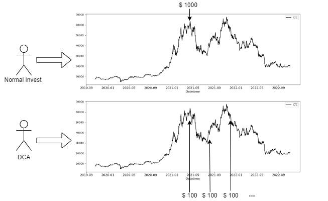

# Reinforcement Learning for Optimal Stopping Problem

This repository is for CP3106 at the National University of Singapore, 
which uses Rainbow DQN, a simple reinforcement learning algorithm, to solve an Optimal Stopping problem.

## Project Background

Some work have demonstrated that **Dollar Cost Averaging (DCA)** is a useful investing strategy that can help deal with 
uncertain markets by making purchases automatic.
DCA involves investing the same amount of money in a target security at regular intervals over a certain period of time,
regardless of price, as shown below. 

The primary objective of this project is to formalize finding a day with a lower investment cost 
during each investment cycle as an **Optimal Stopping** problem. 
We design a custom _OpenAI Gym_ style Reinforcement Learning environment and propose a solution based on **Rainbow-DQN**.



## Repository Structure:

1. **Crypto Data:**
    - Scripts for obtaining up-to-date cryptocurrency data and create a temporary file for experiments.
    - Instructions:
        1. Place the [ChromeDriver](https://chromedriver.chromium.org/downloads) in the same directory.
        2. Execute the following to fetch crypto data from [CoinMarketCap](https://coinmarketcap.com/historical/):
           ```shell
           python .\CoinData.py --sd 20221110 --ed 20221211 --item 100 --save ./Data/
           ```
        3. Generate the temporary `.pkl` file to expedite back-testing:
           ```shell
           python .\GetTempData.py --sd 20221110 --ed 20221211 --index 10 --save_name Data
           ```
    - The `CryptoData.zip` encompasses cryptocurrency data from 2013.04.28 to 2022.11.29 in .csv format.

2. **Back-testing:**
    - Scripts to derive back-testing results using the DCA method.
    - Execution:
      ```shell
      python Back_Testing_with_DCA.py
      ```
      Ensure `Data.pkl` exists in the `./Data` folder before running.
    - Major functions:
        - **ShowEffectiveness**: Constructs the starting date list and triggers the strategy function.
        - **AtomStrategy**: Purchases a single cryptocurrency.
        - **IndexStrategy**: Buys multiple cryptocurrencies based on market capitalization.

3. **RL Environment:**
    - Contains an OpenAI Gym-based reinforcement learning environment tailored for the optimal stopping problem.
    - Environment registration instructions for `CryptoEnv` can be found [here](#how-to-register-the-environment-cryptoenv).

4. **Rainbow DQN:**
    - Includes scripts for the Rainbow DQN agent's training, evaluation, and result visualization.
    - Main script: `rainbow.py`
    - Prior to execution:
        - Register the gym environment `CryptoEnv-v0`.
        - Install required packages: `pip install -r requirements.txt`.
    - Execute with:
      ```shell
      python rainbow.py --ExpID BTC_Exp_1 --frames 30000 --name 0 --wnd 30 --cycle 9 --memory_size 10000 --batch_size 128 --target_update 100 --gamma 0.95 --v_min 0 --v_max 20 --atom_size 51 --n_step 3 --data_-path 'path/to/price/data' --mode 0
      ```
      You can obtain detailed descriptions and default values of these command-line parameters by running the following command: `python rainbow.py -h`. Ensure to adjust these parameters based on your specific needs and dataset.
    - After training, logs are available in `./logs`. For visualization:
      ```shell
      rl_plotter --show --save --avg_group --shaded_std --style default --title "Episode score v.s timesteps" --legend_outside --no_legend_group_num --resample 4096
      ```

5. **Presentation and Report:** 
    - Includes the presentation slides and the project's final report.


### How to Register the Environment `CryptoEnv`:

1. First, install gym: `pip install gym`.
2. Determine the gym installation path:
    - If uncertain, re-run `pip install gym`.
3. Navigate to `./gym/envs/`.
4. Create a new directory named `user`.
5. Transfer `CryptoEnv.py` to the `user` directory.
6. In `user` directory, set up `__init__.py`, include:
   ```python
   from gym.envs.user.CryptoEnv import CryptoEnv
   ```
7. Return to the parent directory: `./gym/envs/`.
8. Modify `__init__.py` to include:
   ```python
   register(
   	id='CryptoEnv-v0',
   	entry_point='gym.envs.user:CryptoEnv',
   )
   ```

The expected directory hierarchy is:
```
|-- path to gym
|    |-- envs
|    |   |-- user
|    |   |   |-- CryptoEnv.py
|    |   |   |-- __init__.py
|    |   |-- __init__.py
```

## References:
1. [Deep Reinforcement Learning Course](https://simoninithomas.github.io/Deep_reinforcement_learning_Course/)
2. [Rainbow DQN Tutorial](https://github.com/Curt-Park/rainbow-is-all-you-need)
3. [Deep Reinforcement Learning Parameter Tuning Guide](https://zhuanlan.zhihu.com/p/345353294)
4. [RL Plotter Tool](https://github.com/gxywy/rl-plotter)
5. [A modern LaTeX Beamer theme](https://github.com/matze/mtheme)
6. [ACM Small Standard Format Template](https://www.overleaf.com/latex/templates/association-for-computing-machinery-acm-small-standard-format-template/sksvmbxyfhnw)

